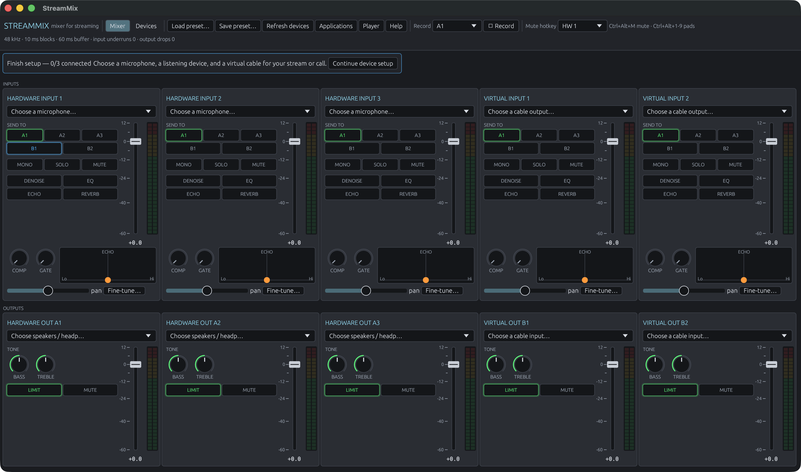
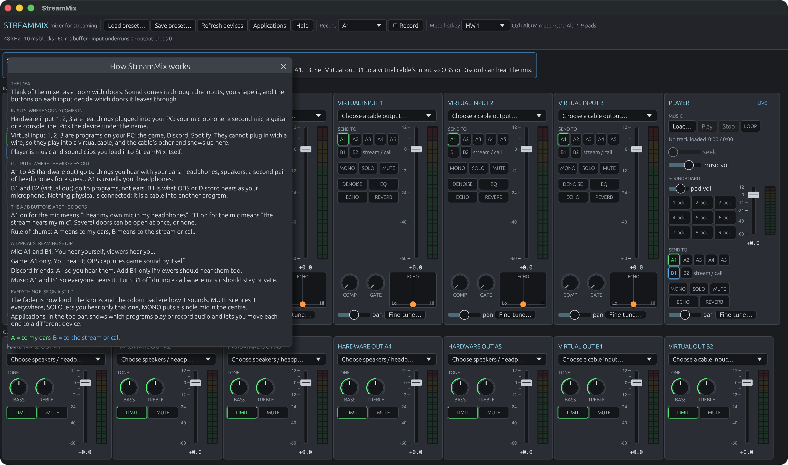

# DHMIX

A free, open Voicemeeter-Potato-style mixer for streaming on Windows. No licence key, no nag screen.



- **6 input strips**: HW 1–3 (microphones, interfaces), VIRT 1–2 (virtual cables that apps play into), PLAYER (soundboard + music)
- **5 output buses**: A1–A3 hardware outs (headphones, speakers, a second PC), B1–B2 virtual outs (what OBS, Discord or a call hears)
- **Per strip**: gain fader, pan, MONO, SOLO, MUTE, routing grid, and an FX chain of denoiser (RNNoise), noise gate, 4-band EQ (low cut, bass, mid, treble), compressor, echo and reverb
- **Per bus**: gain, mute, bass/treble tone, limiter with an adjustable ceiling (LIMIT knob, in dB)
- **Streaming extras**: soundboard with 9 pads and global hotkeys (Ctrl+Alt+1–9), music player with loop and seek, each with its own fader and meter, global mute hotkey (Ctrl+Alt+M), WAV recording of any bus, presets (JSON), state restored on next launch
- **Settings** (top bar): close to tray, start in tray, run on startup, pad hotkeys on or off. The tray icon's menu shows or quits the app.
- Every knob shows its value; click a knob, or the number under a fader, to type a value. Double-click resets.
- Engine runs at 48 kHz in 10 ms blocks; devices at other rates are resampled.

## Download (Windows)

Go to the [Releases page](https://github.com/pdzxc/streammix/releases), download `dhmix.exe` from
the latest release, and run it. It is a single file; nothing else to install except a virtual
cable (next section) if you want app audio in the mix. Windows SmartScreen may warn the first
time because the file is not code-signed: choose "More info" then "Run anyway".

Every push to `main` also builds the .exe (the "Windows build" action keeps it as an artifact),
and pushing a tag publishes a release:

```bash
git tag v0.2.0 && git push origin v0.2.0
```

## Build on Windows

1. Install the Rust toolchain from <https://rustup.rs> (pick the default MSVC toolchain). When it asks, let it install the Visual Studio Build Tools with the "Desktop development with C++" workload.
2. In a terminal inside this folder:

```bat
cargo build --release
```

3. The app is at `target\release\dhmix.exe`. Copy it anywhere; it has no other files.

The first build takes a few minutes (it compiles the GUI and audio libraries). Later builds take seconds.

## Virtual cables on Windows

Windows only lets a kernel driver create an audio device, and installing a driver needs Microsoft attestation signing with a paid EV certificate. DHMIX therefore does what Voicemeeter's competitors do: it uses any virtual cable that is already installed and treats its endpoints like devices.

Install one of these free cables:

- **VB-CABLE** (donationware, free to use): <https://vb-audio.com/Cable/>. It adds `CABLE Input` (a playback device) and `CABLE Output` (a recording device). The optional A+B pack adds two more cables.
- **Virtual Audio Driver** (open source, MIT): <https://github.com/VirtualDrivers/Virtual-Audio-Driver>. Same idea, signed releases on the Releases page.

Then wire it up:

| You want | Do this |
| --- | --- |
| Discord / game audio in your mix | In Windows Sound settings, set that app's output to `CABLE Input`. In DHMIX set VIRT 1's device to `CABLE Output`. |
| OBS / Discord to hear your mix | Set bus B1's device to `CABLE Input` of a *second* cable (for example `CABLE-A Input`). In OBS or Discord, choose that cable's `Output` as the microphone. |
| Hear everything yourself | Set bus A1's device to your headphones. Route each strip to A1. |

The default routing sends every strip to A1 (headphones) and sends HW 1 (your mic) and PLAYER to B1 (the stream/call), which is the usual streaming setup.

## Per-app audio (game, Discord, music in separate strips)

Like Voicemeeter, DHMIX mixes devices; Windows decides which device each app plays to.
The **Applications** button in the top bar opens a window that lists every app currently playing
or recording audio, the device it is on, where that lands in the mixer (for example "VIRT 1 in
the mixer" or "A1 directly, bypassing the mixer"), and a picker to move it. Moving an app uses
the same per-app default that Windows' own Sound settings write, so it sticks across restarts.
The same thing by hand: Settings → System → Sound → Volume mixer (Windows 11) or "App volume and
device preferences" (Windows 10) and set each app's output:

| App | Windows output | DHMIX strip |
| --- | --- | --- |
| Game | `CABLE Input` | VIRT 1 ← `CABLE Output` |
| Discord | `CABLE-A Input` | VIRT 2 ← `CABLE-A Output` |
| Spotify / browser | Share VIRT 1 or VIRT 2, depending on the mix you want | Select that cable's matching output |

Each strip then has its own fader, effects and routing, so you can send the game to your headphones
only, or Discord to the stream at a lower level. DHMIX provides two virtual input strips.

## Soundboard and music

- Click an empty pad to assign an MP3, WAV, FLAC, OGG (Vorbis) or M4A file; click a filled pad to play it; right-click to reassign or clear. Ogg Opus (Discord and WhatsApp clips) is not supported; convert those first.
- Pads may overlap. Ctrl+Alt+1–9 fires them even when a game has focus.
- "Load…" in the Music section plays a track; loop and the seek bar work as expected.
- Because PLAYER is a normal strip, its routing buttons decide who hears it: A1 for you, B1 for viewers or the call.

Files are decoded fully into memory when assigned, so a 5-minute track uses roughly 110 MB while loaded.

## Settings, tray and startup

The **Settings** button in the top bar opens the app's own options. *Close to tray* keeps DHMIX
mixing after the window is closed (quit from the tray icon's menu); *Start in tray* begins
hidden; *Run on startup* registers DHMIX as a login item (a Run registry entry on Windows, a
launch agent on macOS); *Pad hotkeys* turns Ctrl+Alt+1–9 off when they clash with a game. These
are saved in `settings.json` next to the app's other saved state.

For screenshots or testing, `DHMIX_OPEN=player,settings` opens those windows at launch
(also `applications` and `help`).

## Help inside the app

The **Help** button in the top bar opens a plain-language guide to inputs, outputs and the A / B
buttons (A means "to my ears", B means "to the stream or call"). It opens by itself the first time
you launch DHMIX.



## Recording

Pick a bus in the top bar and press "● Rec". The file is 32-bit float WAV at 48 kHz.

## Developing on macOS or Linux

The same source builds and runs there (CoreAudio / ALSA through cpal), which is how it is tested. Virtual cables on macOS are BlackHole or Loopback; on Linux, PipeWire loopbacks.

```bash
cargo test
cargo run
```

`cargo check --target x86_64-pc-windows-msvc` type-checks the Windows code paths from any OS once the target is added with `rustup target add x86_64-pc-windows-msvc`.

## Known limits

- Each device runs on its own clock. Over a long session the engine may drop or repeat one 10 ms block occasionally on a device that drifts; the 60 ms ring buffer hides ordinary jitter.
- Exclusive-mode / ASIO devices are not used; everything goes through WASAPI shared mode.
- Files are decoded on the UI thread, so assigning a long track pauses the window for a second.

## Licence

DHMIX is free and open source under the [MIT licence](LICENSE). The bundled RNNoise model and the
audio libraries it builds on carry their own permissive licences; `cargo license` lists them.
