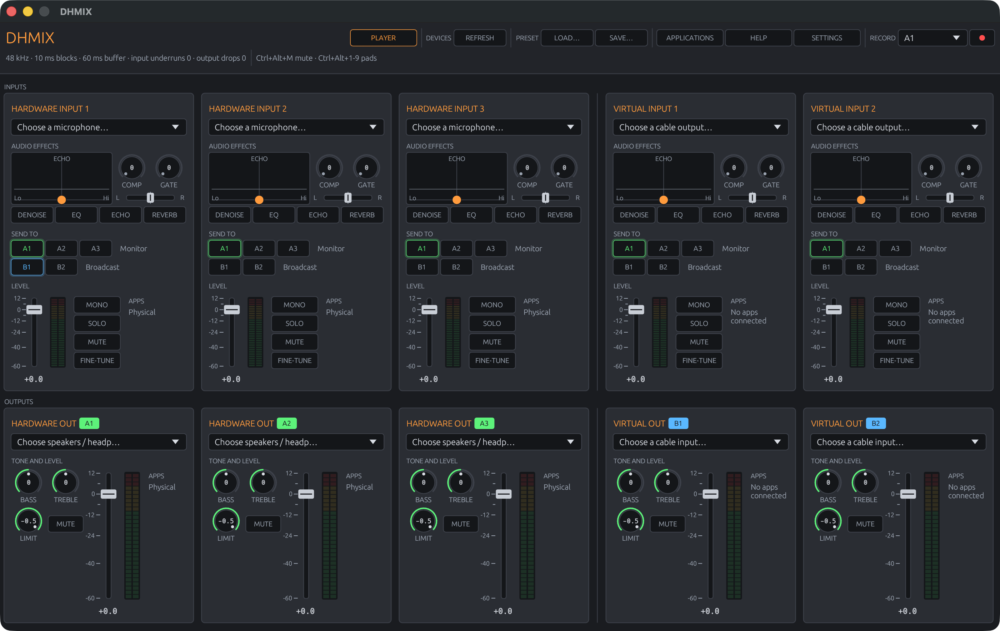

# DHMIX

A free, open mixer for streaming, in the spirit of Voicemeeter Potato. No licence key, no nag
screen. Windows is the target; it also builds and runs on macOS and Linux for development.



## Download

Grab `dhmix.exe` from the [Releases page](https://github.com/pdzxc/dhmix/releases) and run it.
It is a single file. Windows SmartScreen may warn the first time because the file is not
code-signed: choose "More info", then "Run anyway".

To get app audio (games, Discord, Spotify) into the mix you also need a virtual cable, see
[Virtual cables](#virtual-cables-on-windows).

## What it does

- **Inputs**: three hardware inputs (mics, interfaces), two virtual inputs (apps, through a
  virtual cable) and the Player (soundboard and music).
- **Outputs**: A1 to A3 go to your ears (headphones, speakers), B1 and B2 go to programs (OBS,
  Discord, a call).
- **Per input**: fader, pan, MONO, SOLO, MUTE, the A / B send-to buttons, and an effect chain of
  noise suppression (RNNoise), gate, EQ with a colour pad, compressor, echo and reverb, with a
  fine-tune window for every parameter.
- **Per output**: fader, mute, bass and treble, and a limiter with an adjustable ceiling.
- **Player**: nine soundboard pads with global hotkeys (Ctrl+Alt+1 to 9) and a music player with
  loop and seek, each with its own fader and meter.
- **Extras**: global mute hotkey (Ctrl+Alt+M), WAV recording of any output, presets, a tray
  icon, run on startup, and everything restored on the next launch.

Every knob shows its value. Click a knob, or the number under a fader, to type a value;
double-click resets. The engine runs at 48 kHz in 10 ms blocks.

## Virtual cables on Windows

Windows only lets a kernel driver create an audio device, so DHMIX uses any virtual cable that
is already installed and treats its ends like devices. Install one of these free cables:

- **VB-CABLE** (donationware): <https://vb-audio.com/Cable/>. It adds `CABLE Input` (a
  playback device) and `CABLE Output` (a recording device). The optional A+B pack adds two more.
- **Virtual Audio Driver** (open source, MIT):
  <https://github.com/VirtualDrivers/Virtual-Audio-Driver>.

Then wire it up:

| You want | Do this |
| --- | --- |
| Discord or game audio in your mix | In Windows Sound settings, set that app's output to `CABLE Input`. In DHMIX set Virtual input 1's device to `CABLE Output`. |
| OBS or Discord to hear your mix | Set Virtual out B1's device to `CABLE Input` of a *second* cable (for example `CABLE-A Input`). In OBS or Discord, choose that cable's `Output` as the microphone. |
| Hear everything yourself | Set Hardware out A1's device to your headphones. Turn A1 on for each input. |

The default routing sends every input to A1 and sends Hardware input 1 (your mic) and the
Player to B1, which is the usual streaming setup.

**Two clicks instead of Windows settings.** On Windows, each virtual card has a **DEFAULT**
button next to its device picker. On Virtual input 1 it makes that cable the Windows default
output, so every app plays into the mixer. On Virtual out B1 it makes that cable the Windows
default microphone, so OBS, Discord or a call hear your mix. If no cable is installed, the status
line under the top bar says so and links to VB-CABLE.

**Naming.** DHMIX cannot add its own devices to Windows (that needs a signed driver), but you can
rename a cable in Windows Sound settings, for example `CABLE Input` to `DHMIX Input` and
`CABLE Output` to `DHMIX Output`. DHMIX recognises the renamed pair.

## Per-app audio

Windows decides which device each app plays to. The **Applications** button lists every app
currently playing or recording audio, the device it is on, where that lands in the mixer, and a
picker to move it. The same thing by hand: Settings, System, Sound, Volume mixer (Windows 11) or
"App volume and device preferences" (Windows 10).

| App | Windows output | DHMIX input |
| --- | --- | --- |
| Game | `CABLE Input` | Virtual input 1 with `CABLE Output` |
| Discord | `CABLE-A Input` | Virtual input 2 with `CABLE-A Output` |
| Spotify or browser | Share Virtual input 1 or 2 | That cable's output |

## Soundboard and music

Open **Player** in the top bar. Click an empty pad to assign an MP3, WAV, FLAC, OGG (Vorbis) or
M4A file; click a filled pad to play it; right-click to reassign or clear. Pads may overlap and
Ctrl+Alt+1 to 9 fire them even when a game has focus. "Load…" plays a music track. Ogg Opus
files (Discord and WhatsApp clips) are not supported; convert those first.

The Player is an input like any other: its A / B buttons decide who hears it.

## Settings

The **Settings** button holds the app's own options: close to tray, start in tray, run on
startup, and the pad hotkeys on or off. Quit from the tray icon's menu when close-to-tray is on.

## Help

The **Help** button opens a plain-language guide to inputs, outputs and the A / B buttons. It
opens by itself on first launch.


## Recording

Pick an output in the top bar and press the red dot. The file is 32-bit float WAV at 48 kHz.

## Building from source

Install the Rust toolchain from <https://rustup.rs>. On Windows pick the default MSVC toolchain
and let it install the Visual Studio Build Tools with the "Desktop development with C++"
workload. Then:

```bash
cargo build --release
```

The app is at `target/release/dhmix.exe` (or `dhmix` on macOS and Linux). Tests: `cargo test`.
On macOS the virtual cables are BlackHole or Loopback; on Linux, PipeWire loopbacks. Per-app
routing works on Windows only.

Every push to `main` builds the Windows executable in GitHub Actions and keeps it as an
artifact; pushing a tag such as `v0.2.0` publishes a release with the .exe attached.

For screenshots or testing, `DHMIX_OPEN=player,settings` opens those windows at launch (also
`applications` and `help`).

## Known limits

- Each device runs on its own clock. Over a long session the engine may drop or repeat one
  10 ms block on a device that drifts; the 60 ms ring buffer hides ordinary jitter.
- Exclusive-mode / ASIO devices are not used; everything goes through WASAPI shared mode.
- Files are decoded on the UI thread, so assigning a long track pauses the window for a second.

## Licence

DHMIX is free and open source under the [MIT licence](LICENSE). The bundled RNNoise model and
the audio libraries it builds on carry their own permissive licences.
